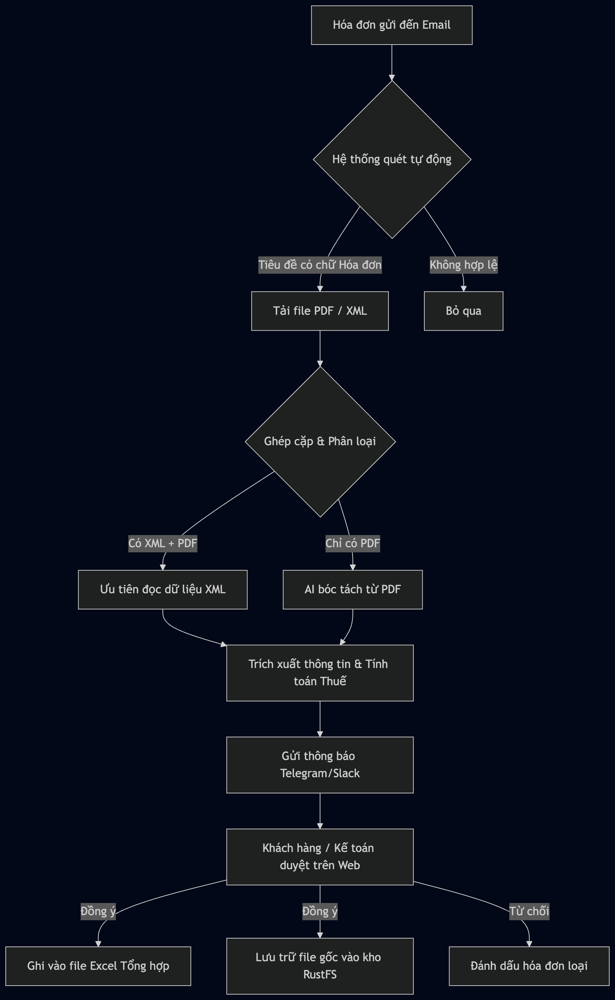

# 🚀 Hệ Thống Tự Động Thu Thập & Xử Lý Hóa Đơn Điện Tử (Invoice Collector)
## Tài liệu phân tích luồng nghiệp vụ & Hướng dẫn sử dụng

Tài liệu này trình bày chi tiết cách thức hệ thống vận hành, từ lúc tiếp nhận hóa đơn cho đến khi kết thúc quy trình kế toán. Đây là cơ sở nghiệp vụ để Khách hàng xem xét và phê duyệt quy trình áp dụng.

---

## 🌟 1. Mục tiêu và Giá trị cốt lõi

Hệ thống được thiết kế để giải quyết bài toán nhập liệu thủ công của phòng kế toán qua 4 giá trị:
1.  **Trí tuệ nhân tạo (AI)** tự động bóc tách dữ liệu mà không cần định nghĩa mẫu cho từng nhà cung cấp.
2.  **Lưu trữ khoa học** giúp tra cứu hóa đơn cũ trong vài giây.

---

## ⚡ 2. Sơ đồ quy trình nghiệp vụ (Workflow)

---

## 🔍 3. Chi tiết các bước xử lý thông minh

### Bước 1: Tiếp nhận và Sàng lọc (Email Listener)
Hệ thống kết nối trực tiếp với hòm thư kế toán qua giao thức bảo mật.
*   **Tần suất quét:** 5 phút/lần (Hoặc lắng nghe sự kiện có mail mới từ mail server).
*   **Bộ lọc thông minh:** Chỉ xử lý các email có từ khóa `[Hóa đơn]` để tránh lẫn lộn với các trao đổi công việc thường ngày.

### Bước 2: Xử lý ưu tiên dữ liệu (Data Normalization)
Đây là bước đảm bảo độ chính xác cao nhất:
*   Nếu nhà cung cấp gửi cả file **PDF** (để xem) và **XML** (dữ liệu): Hệ thống sẽ tự động ghép cặp và ưu tiên dữ liệu từ file **XML** (loại bỏ hoàn toàn sai sót do robot đọc nhầm).
*   Nếu chỉ có file **PDF**: Hệ thống sử dụng AI chuyên dụng để "quét" hình ảnh và văn bản, sau đó tự quy đổi về định dạng chuẩn.

### Bước 3: Kiểm soát chất lượng (Human-in-the-loop)
Hệ thống không tự ý quyết định. Mọi hóa đơn sau khi bóc tách sẽ nằm ở trạng thái **"Chờ phê duyệt"**.
*   Nhân viên hoặc khách hàng sẽ nhận được đường link trực tiếp qua tin nhắn.
*   Giao diện duyệt hiển thị song song: **Thông tin robot đã đọc** và **Hình ảnh hóa đơn gốc** để đối chiếu nhanh.

### Bước 4: Hoàn tất và Lưu trữ (Finalization)
Sau khi nhấn **Xác nhận**:
1.  **Ghi sổ tự động:** Dữ liệu được thêm vào file Excel bảng kê tháng (đúng mẫu 01-2/GTGT).
2.  **Sắp xếp kho lưu trữ:** File gốc được đổi tên theo cấu trúc khoa học: `Năm_Tháng_SoHD_TenNhaCungCap.pdf` và lưu vào thư mục tương ứng.

---

## 🛡️ 4. Tính an toàn và Bảo mật

*   **Dữ liệu khép kín:** Hệ thống chạy trên máy chủ nội bộ. Hóa đơn của bạn không bao giờ rời khỏi hạ tầng của công ty.
*   **Local AI (Trí tuệ nhân tạo nội bộ):** Chúng tôi không sử dụng các dịch vụ AI bên ngoài như ChatGPT để xử lý hóa đơn, đảm bảo bí mật kinh doanh và thông tin nhà cung cấp.

---

## ❓ 5. Các câu hỏi nghiệp vụ quan trọng

**Q: Làm sao để biết hóa đơn nào đã xử lý, hóa đơn nào chưa?**
A: Hệ thống có mục **"Danh sách hóa đơn"** phân loại rõ: Chờ phê duyệt (Màu vàng), Đã xác nhận (Màu xanh), Đã từ chối (Màu đỏ).

**Q: Nếu một hóa đơn bị gửi lặp lại nhiều lần?**
A: Hệ thống dựa trên **Số hóa đơn** và **Mã số thuế người bán** để cảnh báo trùng lặp, giúp bạn không bị kê khai thuế hai lần cho cùng một hóa đơn.

**Q: Tôi có thể tải lại file Excel tổng hợp bất cứ lúc nào không?**
A: Có. Hệ thống luôn duy trì bản Excel cập nhật nhất trong tháng. Bạn chỉ cần vào mục "Xuất file" để tải về bản mới nhất.

---